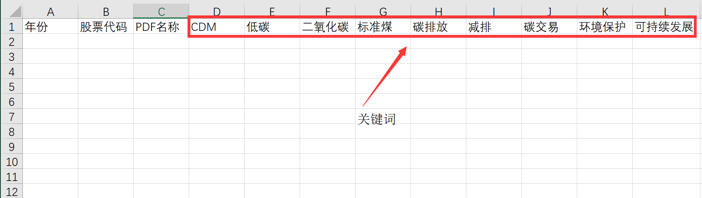
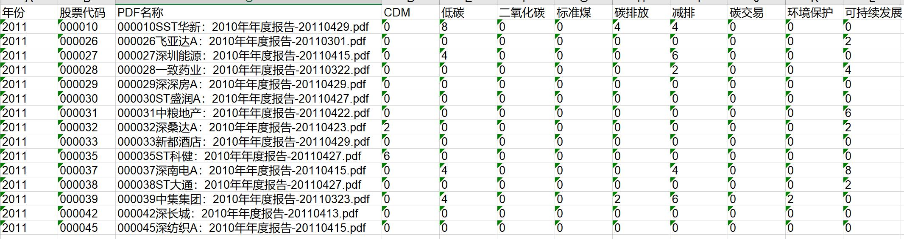

提取PDF关键字，写入Excel

---

摘要：这篇文章介绍如何从PDF文件中提取关键字，然后写入到Excel中。首先程序把PDF解析为txt文件，然后程序从指定的Excel文件中加载关键字，再在txt中去寻找，最后将找到的关键字个数写入Excel

---

- 功能演示
  - 需求描述：在我的`keywordsExtractor` 目录下有一些文件夹，文件夹内是pdf文件，我需要把这些pdf文件跟目标股票进行对比，如果该PDF属于目标股票，那么加载，否则不加载。然后把PDF中的一些特定关键词出现次数提取到Excel中，如下示例：

    

    关键词从D列开始，任意添加。其中A1，B1，C1内容可以更改。

    然后运行程序，得到的结果示例如下：

    

    这里的年份是PDF所在文件夹的名称，你可以自己修改，股票代码是PDF文件名称的前6个字符。

- 实现过程

  - STEP 0: 加载需要的包

    ```python
    # -*- coding: UTF-8 -*-

    """
    1.加载一个指定路径文件夹内的所有pdf文内容
    2.解析所有pdf内容并提取指定内容
    3.把解析出来的指定内容写入Excel表格
    """

    #################
    import xlwt  # 写入文件
    import xlrd  # 打开excel文件
    from xlutils.copy import copy

    import os
    import re
    import sys
    import importlib

    importlib.reload(sys)
    from pdfminer.pdfparser import PDFParser, PDFDocument
    from pdfminer.pdfinterp import PDFResourceManager, PDFPageInterpreter
    from pdfminer.converter import PDFPageAggregator
    from pdfminer.layout import LTTextBoxHorizontal, LAParams
    from pdfminer.pdfinterp import PDFTextExtractionNotAllowed

    import logging

    logging.basicConfig(level=logging.ERROR)

    __author__ = "yooongchun"
    __email__ = "yooongchun@foxmail.com"
    __version__ = "20180429v1"
    ```

    ​


  - STEP 1：加载一个文件夹下的所有pdf文件，获得路径

    ```python
    # 读取一个文件夹目录下所有PDF文档路径,返回所有PDF文件的绝对路径
    def loadPDF(file_path, stock_num_list=None):
        pdf_files = {}  # 保存文件地址和名称：name：path
        files = os.listdir(file_path)
        for file in files:
            if os.path.splitext(file)[1] == '.pdf':  # 判断是否为PDF文件
                if stock_num_list is None or (stock_num_list is not None and file[0:6] in stock_num_list):
                    abso_Path = os.path.join(file_path, file)
                    stock_num = file[0:6]
                    pdf_files[file] = (stock_num, abso_Path)
        return pdf_files

    ```

  - STEP 2：解析PDF转为TXT

    ```python
    # 解析PDF文件，转为txt格式
    def parsePDF(PDF_path, TXT_path):
        with open(PDF_path, 'rb')as fp:  # 以二进制读模式打开
            praser = PDFParser(fp)  # 用文件对象来创建一个pdf文档分析器
            doc = PDFDocument()  # 创建一个PDF文档
            praser.set_document(doc)  # 连接分析器与文档对象
            doc.set_parser(praser)

            # 提供初始化密码
            # 如果没有密码 就创建一个空的字符串
            doc.initialize()

            # 检测文档是否提供txt转换，不提供就忽略
            if not doc.is_extractable:
                raise PDFTextExtractionNotAllowed
            else:
                rsrcmgr = PDFResourceManager()  # 创建PDf 资源管理器 来管理共享资源
                laparams = LAParams()  # 创建一个PDF设备对象
                device = PDFPageAggregator(rsrcmgr, laparams=laparams)
                interpreter = PDFPageInterpreter(rsrcmgr, device)  # 创建一个PDF解释器对象

                # 循环遍历列表，每次处理一个page的内容
                for page in doc.get_pages():  # doc.get_pages() 获取page列表
                    interpreter.process_page(page)
                    layout = device.get_result()  # 接受该页面的LTPage对象
                    # 这里layout是一个LTPage对象 里面存放着 这个page解析出的各种对象 一般包括LTTextBox, LTFigure, LTImage, LTTextBoxHorizontal 等等 想要获取文本就获得对象的text属性，
                    for x in layout:
                        if isinstance(x, LTTextBoxHorizontal):
                            with open(TXT_path, 'a', encoding='UTF-8', errors='ignore') as f:
                                results = x.get_text()
                                # print(results)
                                f.write(results + '\n')
    ```

  - STEP 3：加载目标股票

    ```python
    # 加载目标股票代码
    def getStackNum(excel_path):
        book = xlrd.open_workbook(excel_path)  # 打开一个wordbook
        sheet_ori = book.sheet_by_name('Sheet1')
        return sheet_ori.col_values(0, 0, sheet_ori.nrows)

    ```

  - STEP 4：从Excel中加载关键词

    ```python
    # 从Excel中加载关键词
    def loadKeyWords(excel_path):
        book = xlrd.open_workbook(excel_path)  # 打开一个wordbook
        sheet_ori = book.sheet_by_name('Sheet1')
        return sheet_ori.row_values(0, 3, sheet_ori.ncols)
    ```

  - STEP 5:进行规则匹配，并保存到Excel中

    ```python
    # 加载txt列表寻找关键词并保存到excel
    def matchKeyWords(txt_folder, excel_path, keyWords, year):
        files = os.listdir(txt_folder)
        words_num = []  # 保存所有文件词频
        for file in files:
            word_freq = {}  # 单词出现频率次：word：num
            if os.path.splitext(file)[-1] == ".txt":
                txt_path = os.path.join(txt_folder, file)
                with open(txt_path, "r", encoding='utf-8', errors='ignore')as fp:
                    text = fp.readlines()
                    for word in keyWords:
                        num = 0
                        for line in text:
                            num += line.count(word)
                        word_freq[word] = num
                    stock_num = file[0:6]
                    pdf_name = file.split(".")[0] + "." + file.split(".")[1]
                    words_num.append((word_freq, stock_num, pdf_name))
        # 保存到Excel
        book = xlrd.open_workbook(excel_path)  # 打开一个wordbook
        copy_book = copy(book)
        sheet_copy = copy_book.get_sheet("Sheet1")
        for index, one in enumerate(words_num):
            word_f = one[0]
            stock_num = one[1]
            pdf_name = one[2]
            for ind, word in enumerate(keyWords):
                sheet_copy.write(index + 1, ind + 3, str(word_f[word]))
            sheet_copy.write(index + 1, 0, year)
            sheet_copy.write(index + 1, 1, stock_num)
            sheet_copy.write(index + 1, 2, pdf_name)
        copy_book.save(excel_path +"."+year + ".xls")

    ```

  - STEP 6 :主程序入口

    ```python
    if __name__ == '__main__':
        stockNum_path = r"./stockNum.xlsx"
        pdf_folder = r"./"
        keyWords_path = r"./target.xlsx"

        if len(sys.argv) < 3:
            print("less parameters to run...")
        else:
            flag = str(sys.argv)[1]
            real_time_show = str(sys.argv[2])

            if flag == "True":
                MATCH_STOCK_NUM_FALG = True  # 是否匹配股票代码
            else:
                MATCH_STOCK_NUM_FALG = False
            if real_time_show == "True":
                REAL_TIME_SHOW = True
            else:
                REAL_TIME_SHOW = False

            print("Filter for stock number function is: %s" % MATCH_STOCK_NUM_FALG)
            print("Real time show function: %s" % REAL_TIME_SHOW)

            # 程序开始
            print("Now the program is running...")
            print("load keyWords from Excel:%s" % keyWords_path)
            key_words = loadKeyWords(keyWords_path)
            if MATCH_STOCK_NUM_FALG:
                print("load target stock number from excel:%s" % stockNum_path)
                stock_num_list = getStackNum(stockNum_path)

            folders = os.listdir(pdf_folder)
            for folder in folders:
                if not folder.isdigit():
                    continue
                if os.path.isdir(os.path.join(pdf_folder, folder)) and 2010 < int(folder) < 2018:
                    pdf_path = os.path.join(pdf_folder, folder)
                    pdf_num = len(os.listdir(pdf_path))
                    print("walk through folder:%s ,total files: %d." % (folder, pdf_num))
                    if not MATCH_STOCK_NUM_FALG:
                        stock_num_list = None
                    pdf_files = loadPDF(pdf_path, stock_num_list)  # 返回所有PDF文件路径
                    print("valid files:%d" % len(pdf_files))
                    pdf_to_txt_path = ""
                    count = 0
                    for key, value in pdf_files.items():
                        count += 1
                        print("parser PDF file:%s  %d/%d" % (key, count, len(pdf_files)))
                        one_pdf_path = value[1]  # 绝对路径
                        stock_num = value[0]  # 股票代码
                        pdf_to_txt_path = one_pdf_path + ".txt"  # txt路径
                        parsePDF(one_pdf_path, pdf_to_txt_path)
                        if REAL_TIME_SHOW:
                            print("match keywords...")
                            matchKeyWords(pdf_path, keyWords_path, key_words, folder)
                    if not REAL_TIME_SHOW:
                        print("match keywords...")
                        matchKeyWords(pdf_path, keyWords_path, key_words, folder)
                    print("remove temp txt file")
                    for file in pdf_path:
                        if file.split(".")[-1] == "txt":
                            os.remove(os.path.join(pdf_folder, file))
            print("done!")

    ```

  - STEP 7：调用程序：把上面的代码保存为`pdf_extractor.py`，在命令行使用如下命令

    ```shell
    python3 pdf_extractor.py True True
    ```

    注：上面的第一个`True`代表程序会把目标股票与PDF进行对比，如果你要加载所有PDF文件，那就把它改为`False`；第二个`True` 代表每解析一个PDF文件就会把匹配结果输出。

- STEP 8：生成`exe` 程序：使用`pyinstaller` 工具打包为windows平台下的可执行程序

  ```shell
  pyinstaller -F extractor.py
  ```

  注：需要提前安装`pyinstaller` ，有关其使用，请转到这里：https://blog.csdn.net/zyc121561/article/details/79563662

  ​

  完！

  ​

